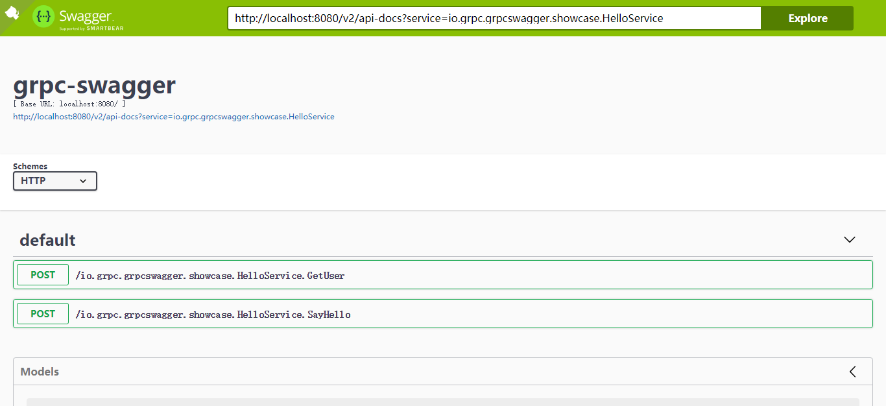
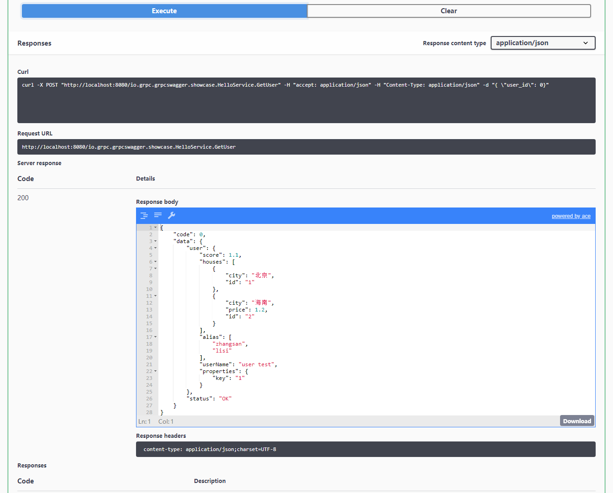

# gRPC-swagger
[](https://travis-ci.com/grpc-swagger/grpc-swagger)
[](https://codecov.io/gh/grpc-swagger/grpc-swagger)
[](https://github.com/Naereen/StrapDown.js/blob/master/LICENSE)

[英文文档](README.md)

<!-- toc -->

- [简介](#%E7%AE%80%E4%BB%8B)
- [特点](#%E7%89%B9%E7%82%B9)
- [运行截图](#%E8%BF%90%E8%A1%8C%E6%88%AA%E5%9B%BE)
- [在线实例](#%E5%9C%A8%E7%BA%BF%E5%AE%9E%E4%BE%8B)
- [部署运行](#%E9%83%A8%E7%BD%B2%E8%BF%90%E8%A1%8C)
  * [使用打包好的jar包](#%E4%BD%BF%E7%94%A8%E6%89%93%E5%8C%85%E5%A5%BD%E7%9A%84jar%E5%8C%85)
  * [编译构建](#%E7%BC%96%E8%AF%91%E6%9E%84%E5%BB%BA)
- [使用流程](#%E4%BD%BF%E7%94%A8%E6%B5%81%E7%A8%8B)
- [接口](#%E6%8E%A5%E5%8F%A3)
  * [注册实例](#%E6%B3%A8%E5%86%8C%E5%AE%9E%E4%BE%8B)
  * [服务列表](#%E6%9C%8D%E5%8A%A1%E5%88%97%E8%A1%A8)
  * [调用 gRPC 方法](#%E8%B0%83%E7%94%A8-grpc-%E6%96%B9%E6%B3%95)
  * [Swagger 接口](#swagger-%E6%8E%A5%E5%8F%A3)
- [致谢](#%E8%87%B4%E8%B0%A2)
- [Contribute](#contribute)
- [FAQ](#faq)
- [License](#license)

<!-- tocstop -->

## 简介 
gRPC-swagger 是基于 [gRPC 反射](https://github.com/grpc/grpc/blob/master/doc/server-reflection.md)开发的一款 [gRPC](https://github.com/grpc/) 调试工具，可以使用 swagger-ui 方便地展示和调用 gRPC 方法。因为 gRPC-swagger 是基于反射开发，所以使用时无需修改 proto 及相关的代码实现，只需在启动服务时开启反射功能。

## 特点
* 简单易用，只需启动服务时允许反射，无需修改 proto 及相关的实现。
* 集成 swagger-ui，可以方便的查看 gRPC 方法和参数定义。
* 通过 http 方式调用 gRPC 服务，极大的提高了测试效率。

## 运行截图





## 在线实例
[demo](http://ui.grpcs.top)

## 部署运行
### 使用打包好的jar包
```base
wget https://github.com/grpc-swagger/grpc-swagger/releases/download/0.1.1/grpc-swagger-web-0.0.1-SNAPSHOT.jar
java -jar grpc-swagger-web-0.0.1-SNAPSHOT.jar
```
### 编译构建
```bash
git clone https://github.com/grpc-swagger/grpc-swagger
cd grpc-swagger
mvn clean package
java -jar grpc-swagger-web/target/grpc-swagger-web-0.0.1-SNAPSHOT.jar
```
默认使用8080端口，如果使用其他端口可以通过`--server.port=端口号`的方式设置
```bash
java -jar grpc-swagger-web/target/grpc-swagger-web-0.0.1-SNAPSHOT.jar --server.port=8888
```

## 使用流程
1. 运行 gRPC-swagger，具体参考[部署运行](#部署运行)
2. 启动服务时开启反射。下面是 java 示例  
   pom.xml 中添加依赖
   ```xml
   <dependency>
       <groupId>io.grpc</groupId>
       <artifactId>grpc-services</artifactId>
       <version>${grpc.version}</version>
   </dependency>
   ```
   启动服务时允许反射：
   ```java
   Server server = ServerBuilder.forPort(SERVER_PORT)
       .addService(new HelloServiceImpl())
       .addService(ProtoReflectionService.newInstance())
       .build()
       .start();
   ```
3. 注册实例，通过 [register](#注册实例) 将提供服务的实例注册到 gRPC-swagger 上，gRPC-swagger 会自动扫描服务，注册完成之后会返回注册成功的服务。后面可以通过 [listServices](#列出服务) 接口查看注册成功的服务。为了方便使用，[这里](http://ui.grpcs.top/service.html) 提供了一个简单的 html 页面。
4. 使用 [swagger-ui](http://ui.grpcs.top/) 查看 gRPC 服务，在输入框中输入 `<host:port>/v2/api?service=<fullServiceName>`，其中`fullServiceName` 就是上面返回注册成功的服务。
5. 点击 `Try it out` 进行服务测试

## 接口

### 注册实例
url：`/register`

参数：
* `host` - 地址（必填）
* `port` - 端口（必填）
* `groupName` - 分组名（选填），默认是 `host:port`，通过指定分组名可以将部署相同服务的实例归为一组

返回示例

```json 
{
    "code": 0, 
    "data": {
        "groupName": "localhost:12347", 
        "services": [
            "io.grpc.grpcswagger.showcase.HelloService"
        ], 
        "endpoints": [
            "localhost:12347"
        ], 
        "success": true
    }
}
```

### 服务列表
url: `/listServices`

返回示例

```json 
{
    "code": 0,
    "data": {
        "localhost:12347": {
            "groupName": "localhost:12347",
            "services": [
                "io.grpc.grpcswagger.showcase.HelloService"
            ],
            "endpoints": [
                "localhost:12347"
            ],
            "success": true
        }
    }
}
```

### 调用 gRPC 方法 
url: `/{rawFullMethodName}`

参数：
* `rawFullMethodName` - 需要调用方法的完整名，例如 `io.grpc.grpcswagger.showcase.HelloService.GetUser`
* `payload` - gRPC 方法参数，JSON 格式。可以使用 `endpoint` 参数，来指定需要调用的实例。

返回结果就是方法执行结果。

### Swagger 接口
url： `/v2/api-docs`

返回 swagger-ui 展示需要的数据。

参数：
* service - 完整的 services 名称，就是 listServices 中返回的 services 里的值

## 致谢
感谢 [polyglot](https://github.com/grpc-ecosystem/polyglot) 项目，本项目中 gRPC 反射相关逻辑基于该项目进行修改。

## Contribute
Feel free to open an issue or pull request. We will appreciate it!

## FAQ

## License
[MIT License.](/LICENSE)
